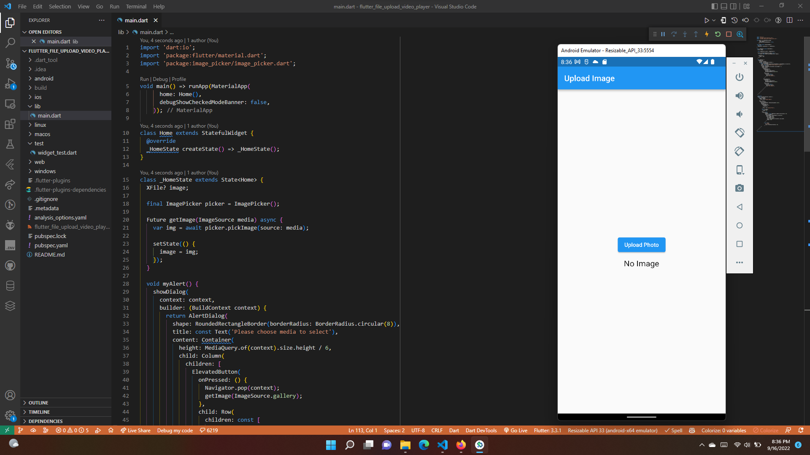
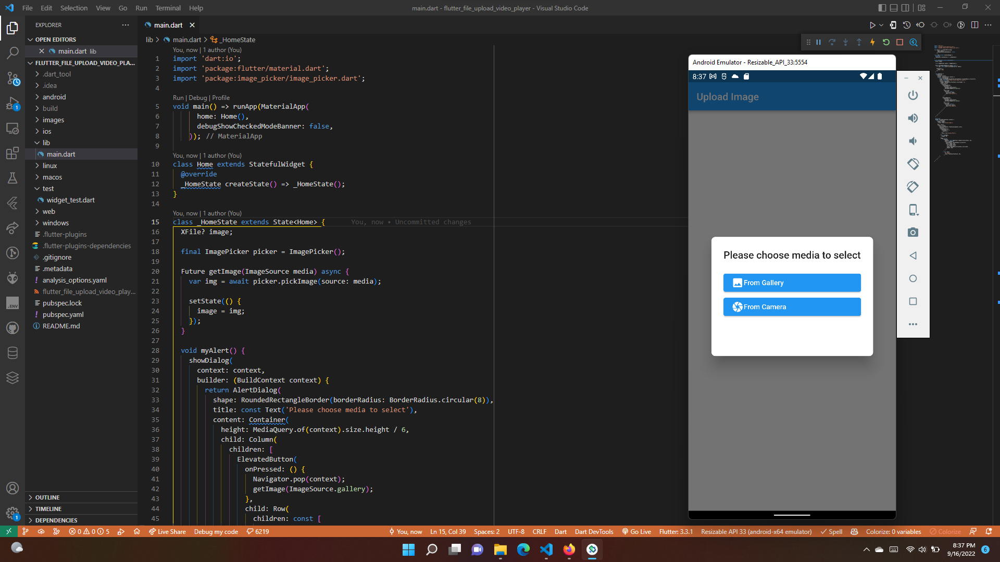
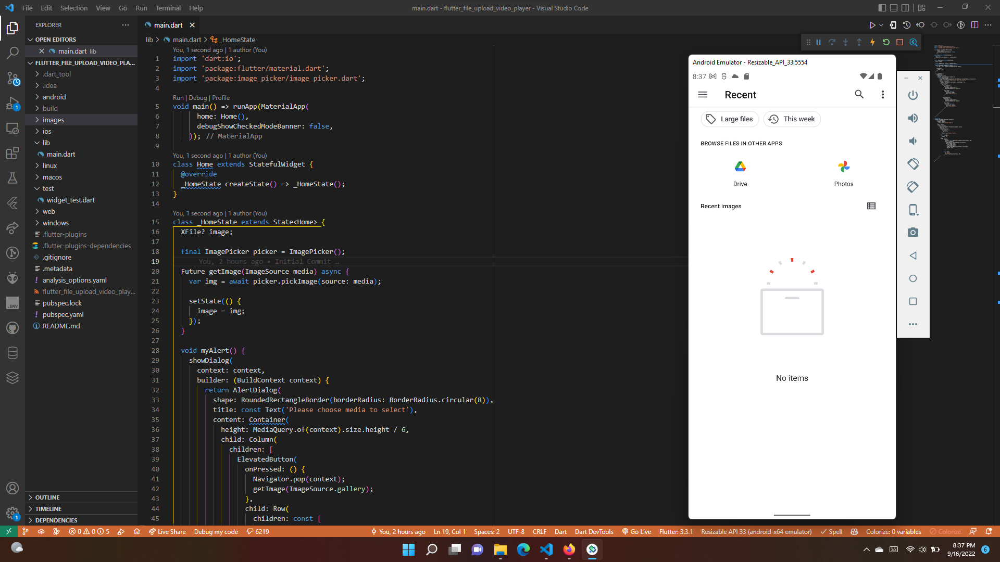

# Local Storage dan Video Player

## Tujuan Pembelajaran

Setelah menyelesaikan bab ini, Anda akan memiliki kemampuan:
* Mengimplementasikan fitur upload file dalam aplikasi
* Mengimplementasikan fitur video player dalam aplikasi

## Plugin 

Upload File
* image_picker

Video Player Plugin
* video_player

# Praktikum

## Upload File

* Terdapat tampilan tombol untuk upload gambar

* Menampilkan pop up yang terdapat 2 opsi button yaitu camera dan gallery

* Tampilan upload dari gallery

* Menampilkan tampilan video player yang sudah diputar

